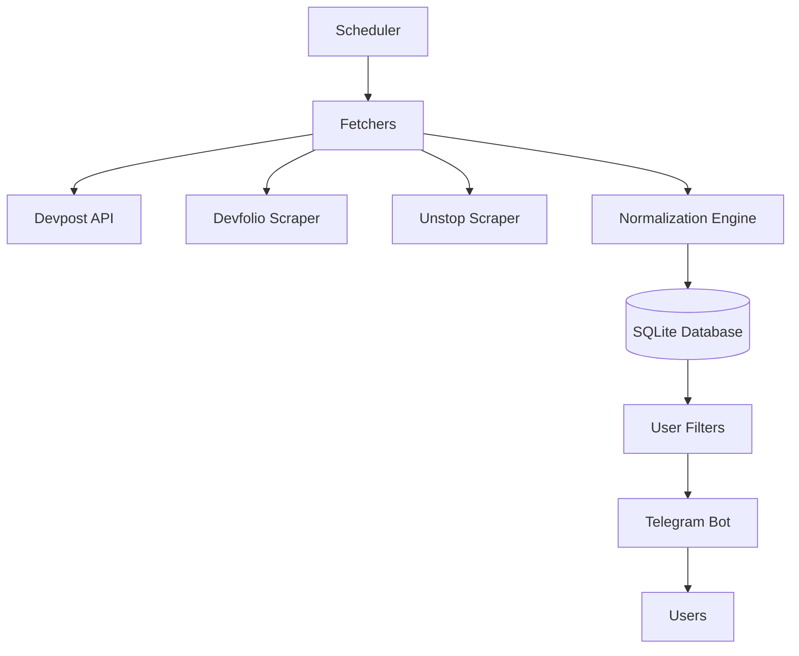

# Hackathon Alert System

## Overview

Automated pipeline that fetches hackathons from Devpost,
deduplicates them using SQLite,
and delivers alerts through Telegram.

## Architecture



## Features

- Automated ingestion
- Persistent deduplication
- Telegram notifications
- Scheduled execution
- Modular fetchers

## Tech Stack

- Python
- Requests
- SQLite
- Telegram Bot API
- Schedule

## Run

Install dependencies and start the scheduler:

```bash
pip install -r requirements.txt
python scheduler.py
```
